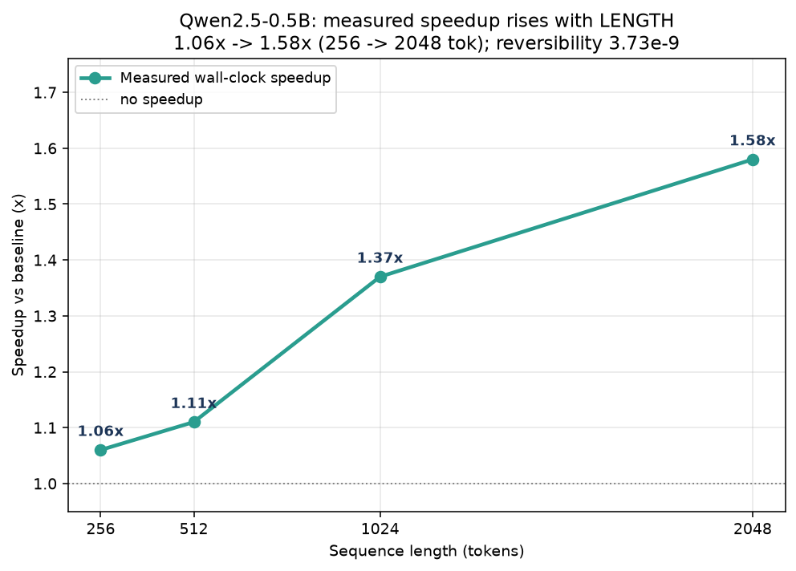
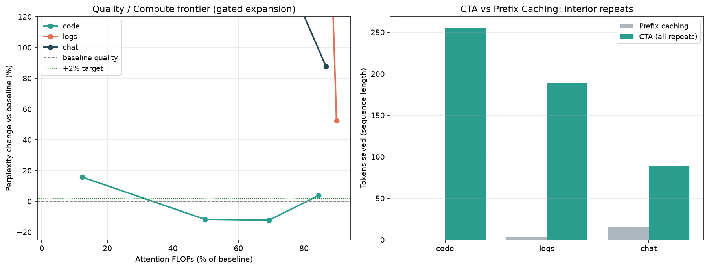
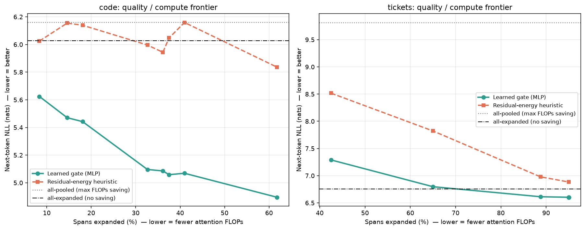
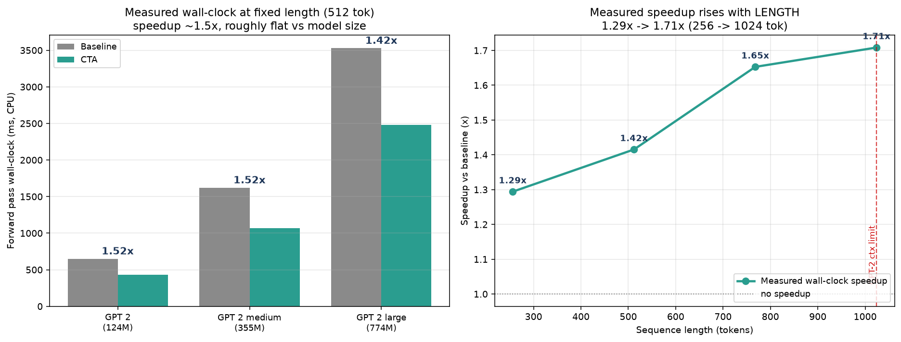

# Compositional Token Algebra (CTA)

> Обратимое, ограниченное сессией, беспараметрическое сжатие токенов для
> амортизации вычислений в замороженных трансформерах — с обучаемым
> per-span gate, который трассирует фронтир «качество / вычисления».

**Референсная реализация и полный пакет воспроизведения для препринта CTA.**
📄 **Препринт (PDF):** [`paper/cta.pdf`](paper/cta.pdf)

*English version below — see [English description](#english-version).*

---

## Что такое CTA?

В длинном контексте трансформера одни и те же участки токенов (идентичные
блоки импортов, шаблонные функции, повторяющиеся системные промпты, поля
тикетов по шаблону) кодируются заново снова и снова. Каждый повтор платит
полную стоимость внимания \(O(L^2)\), хотя новой информации не несёт.

**Compositional Token Algebra (CTA)** рассматривает поток токенов как алгебру.
В рамках одной сессии (контекста) он:

1. **Находит** повторяющиеся спаны rolling-hash-детектором (без параметров).
2. **Сворачивает (compose)** каждый повторяющийся спан в один композитный
   эмбеддинг \(\bar{e}\) — функцию исходных эмбеддингов, **без новых
   параметров**.
3. Делает свёртку **обратимой без потерь**: `decompose(compose(x)) == x` с
   точностью float32, ничего не выбрасывается.
4. **Гейтит**, какие спаны разворачивать обратно в полные токены, а какие
   оставить свёрнутыми — обменивая perplexity на FLOPs внимания.

Насколько нам известно, CTA — единственный метод, который одновременно
**обратим**, **ограничен сессией**, **беспараметричен** и является техникой
**амортизации вычислений** (а не сжатием с потерями и не заменой
токенизатора). Полное сравнение с ASG, R3Mem, H-Net, Dynamic Token Pooling,
ToMe и BLT — в секции Related Work препринта.

### Два способа гейтинга

- **Эвристика на остаточной энергии** (без параметров): разворачиваем спаны,
  чьи внутренние токены сильнее всего отклоняются от центроида, — то есть
  те, что теряют больше всего информации при свёртке.
- **Обучаемый gate (`GateMLP`)**: крошечный MLP
  (`Linear(2d+2 → 128) → GELU → Linear(128 → 1)`, ~200K параметров),
  предсказывающий per-span score разворачивания по вектору запроса \(q\),
  среднему эмбеддингу спана \(\bar{e}\) и двум статистикам спана. Обучается
  через дифференцируемую релаксацию **Gumbel-Sigmoid** с лоссом
  **CE + sparsity (бюджет FLOPs)**. Backbone GPT-2 полностью заморожен.

**Главный результат:** обучаемый gate **строго доминирует** над эвристикой на
*любом* бюджете вычислений — и на code-бенчмарке, и на tickets.

---

## Ключевые результаты

Все числа получены на **замороженном GPT-2 small** (124M, 12 слоёв,
\(d=768\)) на корпусах с высокой повторяемостью. FLOPs внимания считаются
через прокси \(n_\text{layer}\cdot 2\cdot L^2\cdot d\).

### 1. Обратимость (без потерь)

Операторы compose/decompose точно обратимы: **максимальная ошибка
восстановления `4.77e-7`** (машинный эпсилон float32) во всех режимах
скоринга. CTA никогда не выбрасывает информацию — разворачивание всегда
доступно.

### 2. Наивная непрозрачная свёртка *недостаточна*

Свёртывание повторов в непрозрачные композиты без разворачивания резко
ухудшает качество, и ущерб растёт с тем, сколько *различающего* контента
следует за каждым повтором:

| Пример | Токенов (→) | Attn FLOPs | PPL (base → CTA) | ΔPPL |
|--------|-----------:|-----------:|-----------------:|-----:|
| code   | 394 → 138  | 12.3%      | 33.63 → 38.95    | +15.8% |
| logs   | 232 → 40   | 3.0%       | 3.57 → 246.95    | +6810% |
| chat   | 131 → 27   | 4.2%       | 3.65 → 592.83    | +16165% |

**Диагноз:** причина деградации — **непрозрачность содержимого**, а не
перемешивание позиций. Контроль с якорной позицией (сохранение исходных
position ids) оказался *хуже*, а не лучше (code 38.9 → 98.6), что исключает
позицию как причину. → `make diagnose`.

### 3. Гейтированное разворачивание восстанавливает — и превосходит — baseline (эвристика)

Выборочное разворачивание спанов с наивысшей полезностью трассирует фронтир
«качество/вычисления». На code CTA становится **лучше полного baseline при
вдвое меньших FLOPs внимания**:

| Пример | Бюджет | Attn FLOPs | ΔPPL vs baseline |
|--------|-------:|-----------:|-----------------:|
| code   | 25%    | 49.8%      | **−11.7%** (лучше) |
| code   | 50%    | 69.3%      | **−12.3%** (лучше) |
| logs   | 75%    | 89.9%      | +52.3% |
| chat   | 75%    | 86.7%      | +87.6% |

→ `make frontier`

### 4. Обучаемый gate строго доминирует над эвристикой

При одинаковых бюджетах разворачивания (next-token NLL, чем меньше — тем
лучше; референсы all-pooled / all-expanded: code 6.16 / 6.03, tickets
9.82 / 6.75):

**code** (n = 144 спанов)

| λ (sparsity) | Развёрнуто | Learned NLL | Heuristic NLL | Выигрыш |
|-------------:|---------:|------------:|--------------:|-----:|
| 0.05 | 41.0% | 5.069 | 6.159 | +1.090 |
| 0.10 | 37.5% | **5.059** | 6.047 | +0.989 |
| 3.00 |  8.3% | 5.624 | 6.025 | +0.400 |

При λ=0.10 обучаемый gate достигает **5.059 NLL — ниже, чем all-expanded
6.03**, разворачивая при этом лишь 37.5% спанов.

**tickets** (n = 80 спанов)

| λ (sparsity) | Развёрнуто | Learned NLL | Heuristic NLL | Выигрыш |
|-------------:|---------:|------------:|--------------:|-----:|
| 1.5 | 65.0% | 6.798 | 7.823 | +1.025 |
| 3.0 | 42.5% | 7.290 | 8.517 | +1.227 |

→ `make gate`

### 5. Killer-эксперимент: CTA vs prefix caching

Prefix caching амортизирует только *общий префикс*. CTA дополнительно
сжимает **внутренние** повторы, до которых prefix caching структурно
дотянуться не может:

| Метод | code | logs | chat |
|--------|-----:|-----:|-----:|
| Prefix caching (сэкономлено токенов) | 0 | 3 | 15 |
| **CTA (сэкономлено токенов)** | **256** | **192** | **104** |

→ `make killer`

### 6. Где CTA выигрывает — граница избыточности

Диагностика вреда от свёртки показывает **23-кратный разрыв**: свёртка
стоит **0.133 nats** на code против **3.063 nats** на tickets.

- **Глубокая избыточность** (code, шаблонный код — повторы взаимозаменяемы):
  CTA — явный выигрыш, большая экономия FLOPs при *лучшей* perplexity.
- **Поверхностная избыточность** (структурированные логи/тикеты —
  повторяющийся шаблон предшествует различающему контенту): CTA нужно
  агрессивное разворачивание; экономия скромнее.

### 7. Wall-clock валидация (замеры на реальном железе)

Все числа ниже — **измеренное сквозное CPU wall-clock время** (прогрев +
медиана повторов, пиковый RSS) по лестнице размеров моделей и по свипу
длин. Это реализованные ускорения, а не теоретические предсказания.
`→ make walltime`

**По размеру модели** (фиксированные 512 токенов, n=512 → m=340 после
свёртки):

| Модель | Параметров | Baseline | CTA | Ускорение | Пик RAM |
|-------|-------:|---------:|----:|:-------:|---------:|
| GPT-2 small  | 124M | 651 ms  | 429 ms  | **1.52×** | 1241 MB |
| GPT-2 medium | 355M | 1622 ms | 1070 ms | **1.52×** | 2187 MB |
| GPT-2 large  | 774M | 3529 ms | 2480 ms | **1.42×** | 3893 MB |

Оверхед compose — **< 0.3%** от времени CTA (пренебрежимо мал). Ускорение
примерно **плоское по размеру модели** при фиксированной длине — CTA
относительно *не* ускоряется на бо́льших моделях. (Квадратичный подсчёт
FLOPs внимания предсказывает бо́льшую экономию ~2.3×; реализованное число
ниже, потому что MLP, `lm_head` и эмбеддинги линейны по L и не
сокращаются — именно поэтому мы сообщаем измеренное wall-clock, а не
оценку FLOPs.)

**По длине последовательности** (GPT-2 small; там, где квадратичный член
реально кусается):

| Сырых токенов | m после свёртки | Baseline | CTA | Ускорение |
|-----------:|------------:|---------:|----:|:-------:|
| 256  | 193 | 319 ms  | 246 ms | 1.29× |
| 512  | 340 | 620 ms  | 438 ms | 1.42× |
| 768  | 485 | 1025 ms | 620 ms | **1.65×** |
| 1024 | 709 | 1339 ms | 784 ms | **1.71×** |

Ускорение **растёт с длиной контекста** — по мере того как внимание
начинает доминировать. 1024-токенный лимит позиционных эмбеддингов
GPT-2 ограничивает свип baseline (сырые последовательности длиннее 1024
падают в `wpe`), так что самые большие выигрыши живут чуть ниже этого
потолка.

**На современном backbone (Qwen2.5-0.5B).** Чтобы подтвердить, что
механизм не привязан к дизайну GPT-2 образца 2019 года, мы повторяем
wall-clock замеры на **Qwen2.5-0.5B** (494M, 24 слоя, d=896, RoPE +
grouped-query attention 14/2 + SwiGLU, окно 32k). CTA работает
исключительно с входными эмбеддингами
(`model.model(inputs_embeds=...)` + `lm_head`), поэтому портирование
потребовало **никаких изменений в алгоритме** — только forward-wrapper.
Обратимость даже чище, чем у GPT-2 (**макс. L∞ ошибка 3.73e-9** vs
4.77e-7), и ускорение снова растёт с длиной — измерено до 2048 токенов
благодаря окну 32k:

| Длина | m после свёртки | Baseline | CTA | Ускорение |
|-------:|------------:|---------:|----:|:-------:|
| 256  | 228  | 1079 ms | 1016 ms | 1.06× |
| 512  | 421  | 2163 ms | 1942 ms | 1.11× |
| 1024 | 727  | 4340 ms | 3176 ms | **1.37×** |
| 2048 | 1286 | 9010 ms | 5688 ms | **1.58×** |

При фиксированной длине реализованное ускорение **ниже, чем у GPT-2**
(1.11× vs 1.42× на 512), потому что у Qwen более глубокий стек (24 против
12 слоёв) и намного больший LM head (~152k против ~50k словаря), так что
линейная по длине стоимость занимает бо́льшую долю общего compute. Но
**тренд идентичен и усиливается с длиной** — та же история о
квадратичном внимании, но на современной архитектуре.
`→ make walltime-qwen`



**Бонус — расширение контекстного окна.** Поскольку свёртка обратима и
ограничена сессией, CTA может уместить **~1900 сырых токенов в
1024-токенное окно GPT-2** (сыро 1900 → m 1022; baseline вылетает за 1024).
Это эффективное **~1.9× расширение контекста бесплатно** на избыточных
входах. Настоящий полезный побочный эффект — но честный: фактор
расширения равен коэффициенту свёртки, поэтому он **зависит от корпуса**,
деградирует на текстах с поверхностной избыточностью и **не** заменяет
архитектурные методы длинного контекста.

`→ make walltime` запускает полный бенчмарк (МЕДЛЕННО: скачивает/грузит
все три backbone'а); `→ make plots-walltime` перерисовывает фигуру из
поставляемого JSON.

### Рисунки







Первые две фигуры появляются в препринте; wall-clock фигура подкрепляет
новую секцию Wall-Clock Validation препринта. Регенерация фронтир-фигур —
`make plots`, wall-clock фигуры — `make plots-walltime`.

---

## Структура репозитория

```
cta-repo/
├── README.md                 # этот файл
├── LICENSE                   # MIT (файлы корпуса — под своими лицензиями)
├── requirements.txt          # torch, transformers, numpy, matplotlib
├── Makefile                  # цели воспроизведения (см. ниже)
├── paper/
│   ├── cta.pdf               # препринт (10 страниц, arXiv-ready)
│   ├── cta.tex               # исходник LaTeX
│   ├── cta_results.png       # фигура 1
│   ├── gate_frontier.png     # фигура 2
│   └── walltime_results.png  # фигура 3 (wall-clock валидация)
├── src/cta/                  # пакет CTA (импорт: `import cta`)
│   ├── __init__.py
│   ├── algebra.py            # compose / decompose / score_fn (обратимо)
│   ├── detector.py           # rolling-hash детектор повторов + сегменты
│   ├── model.py              # forward-пути замороженного GPT-2 + прокси attention_flops
│   └── learned_gate.py       # GateMLP + gumbel_sigmoid
├── data/
│   ├── download_corpus.sh    # скачать 6 файлов кода с GitHub + собрать tickets
│   ├── data.py               # инлайн SAMPLES (code/logs/chat/prose) + SYS-промпт
│   ├── make_tickets.py       # генератор синтетических Jira-тикетов (с seed)
│   └── corpus/               # заполняется download_corpus.sh (code_*.py, tickets.txt)
├── experiments/
│   ├── _bootstrap.py         # настройка путей: каждый скрипт запускается из любого CWD
│   ├── evaluate.py           # PPL и FLOPs CTA vs baseline на последовательность
│   ├── run_main.py           # основной свип (МЕДЛЕННО)   -> results_main.json
│   ├── gate.py               # эвристический фронтир (МЕДЛЕННО) -> results_frontier.json
│   ├── build_cache.py        # кэш NLL по спанам (МЕДЛЕННО) -> cache_*.pt
│   ├── train_gate.py         # обучение gate (БЫСТРО) -> results_gate.json
│   ├── killer.py             # CTA vs prefix caching (БЫСТРО)
│   ├── diagnose.py           # аблация позиция vs непрозрачность контента
│   ├── plot.py               # -> results/figures/cta_results.png
│   ├── plot_gate.py          # -> results/figures/gate_frontier.png
│   ├── benchmark_walltime.py # реальный CPU wall-clock: лестница размеров + свип длин (МЕДЛЕННО)
│   └── plot_walltime.py      # -> results/figures/walltime_results.png
└── results/
    ├── raw/                  # поставляемые JSON с результатами + предпосчитанные кэши gate (.pt)
    └── figures/              # регенерируемые PNG
```

---

## Установка

Требуется **Python ≥ 3.10** (разработка на 3.14, только CPU — GPU не нужен).

```bash
git clone <this-repo-url> cta-repo
cd cta-repo
python -m venv .venv && source .venv/bin/activate   # опционально
make setup          # == pip install -r requirements.txt
```

Первый запуск скачает GPT-2 small (~500 MB) с HuggingFace и закэширует.

---

## Воспроизведение результатов

Репозиторий **поставляет предпосчитанные кэши для обучения gate**
(`results/raw/cache_code.pt`, `cache_tickets.pt`) и все JSON-файлы
результатов, поэтому ключевой результат обучаемого gate и обе фигуры
воспроизводятся за **секунды**, без GPU и без дорогих forward-проходов
через замороженный GPT-2.

### Быстрый путь (рекомендуется, ~1 минута, без проходов через backbone)

```bash
make all-fast       # = make gate + make plots
```

- `make gate` переобучает `GateMLP` из поставляемых кэшей и пишет
  `results/raw/results_gate.json`. На **code** при λ=0.10 вы должны увидеть
  `learned_nll ≈ 5.059`, обгоняющий `heur_nll ≈ 6.047` (выигрыш +0.989);
  на **tickets** при λ=1.5 — `6.798` vs `7.823` (выигрыш +1.025).
  Обучение детерминировано (`torch.manual_seed(0)`) — вывод совпадает с
  поставляемым `results_gate.json` побайтово.
- `make plots` перерисовывает обе фигуры препринта в `results/figures/`.

Другие быстрые/умеренные проверки:

```bash
make killer         # CTA vs prefix caching (256/192/104 токенов сэкономлено)
make diagnose       # подтверждает: причина ущерба — непрозрачность, не позиция
```

### Полный путь (МЕДЛЕННО на CPU — реальные прогоны замороженного GPT-2)

Чтобы пересобрать всё с сырого текста, включая дорогие проходы:

```bash
make corpus         # скачать 6 файлов кода с GitHub + сгенерировать tickets.txt
make main           # свип CTA vs baseline          -> results_main.json
make frontier       # эвристический гейтированный фронтир -> results_frontier.json
make cache          # пересобрать per-span кэши     -> results/raw/cache_*.pt
make gate           # переобучить gate на свежих кэшах -> results_gate.json
make plots          # фигуры
```

> **Заметка про CPU.** На машине с 2 vCPU проходы через backbone медленные,
> поэтому `build_cache.py` ограничен (code: `max_chunks=12`,
> `max_spans_per_chunk=12`; tickets: `8, 10`; `CHUNK=384`). Эти лимиты
> воспроизводят размеры кэшей из статьи (code n=144, tickets n=80).
> Установите `OMP_NUM_THREADS=2` (Makefile делает это за вас).

### Код-корпус

`make corpus` скачивает шесть реальных Python-файлов с апстрим-GitHub
(requests, Flask, Click, CPython) и генерирует 60 seeded-синтетических
Jira-тикетов. Файлы кода сохраняют свои **апстрим-лицензии** и здесь не
распространяются — только скрипт скачивания. Поскольку апстрим-файлы
дрейфуют, побайтовый снапшот, использованный в статье, — это копия,
уже присутствующая в `data/corpus/` в релиз-тарболе.

### Сборка препринта

PDF включён по пути [`paper/cta.pdf`](paper/cta.pdf). Для пересборки нужен
LaTeX-тулчейн (рекомендуется [Tectonic](https://tectonic-typesetting.github.io/)):

```bash
make paper          # cd paper && tectonic cta.tex
```

---

## Как самому проверить ключевое утверждение

Главное утверждение — *обучаемый gate обгоняет беспараметрическую
эвристику на любом бюджете* — проверяется end-to-end примерно за минуту:

```bash
make setup
make gate           # читает поставляемые кэши, переобучает gate, печатает таблицу фронтира
```

Сравните столбцы `learned_nll` и `heur_nll@same`: `gain` положителен на
каждой строке — и на **code**, и на **tickets**.

---

## Цитирование

```bibtex
@misc{cta2026,
  title  = {Compositional Token Algebra: Reversible, Session-Scoped,
            Parameter-Free Token Compression with a Learnable Compute Gate},
  author = {Serzhantov, Vladimir},
  year   = {2026},
  note   = {Preprint}
}
```

## Лицензия

Код и скрипты экспериментов: **MIT** (см. [`LICENSE`](LICENSE)). Скачиваемый
код-корпус состоит из сторонних open-source файлов под их собственными
апстрим-лицензиями (Apache-2.0 / BSD / PSF) и под MIT не распространяется.

---
---

<a name="english-version"></a>
# Compositional Token Algebra (CTA) — English description

> Reversible, session-scoped, parameter-free token compression for compute
> amortization in frozen transformer LMs — with a learnable per-span gate that
> traces the quality/compute frontier.

**Reference implementation and full reproduction package for the CTA preprint.**
📄 **Preprint (PDF):** [`paper/cta.pdf`](paper/cta.pdf)

## What is CTA?

Long transformer contexts repeatedly re-encode the *same* spans of tokens —
identical import blocks, boilerplate functions, repeated system prompts,
templated ticket fields. Every repeat pays the full \(O(L^2)\) attention cost
again, even though it carries no new information.

**Compositional Token Algebra (CTA)** treats the token stream as an algebra.
Within a single context (session) it:

1. **Detects** repeated spans with a rolling hash (parameter-free).
2. **Composes** each repeated span into a single *composite embedding*
   \(\bar{e}\) — a function of the original token embeddings, adding **no new
   parameters**.
3. Keeps the composition **losslessly reversible**: `decompose(compose(x)) == x`
   to float32 machine precision, so nothing is thrown away.
4. **Gates** which spans to expand back to full tokens vs. keep pooled, trading
   perplexity for attention FLOPs.

CTA is, to our knowledge, the only method that is simultaneously **reversible**,
**session-scoped**, **parameter-free**, and a **compute-amortization** technique
(rather than lossy compression or a learned-tokenizer replacement). See the
Related Work section of the preprint for the full comparison against ASG,
R3Mem, H-Net, Dynamic Token Pooling, ToMe, and BLT.

### Two gating strategies

- **Residual-energy heuristic** (parameter-free): expand the spans whose interior
  tokens deviate most from their centroid — i.e. the ones that lose the most
  information when pooled.
- **Learnable gate (`GateMLP`)**: a tiny MLP
  (`Linear(2d+2 → 128) → GELU → Linear(128 → 1)`, ~200K params) that predicts a
  per-span expand score from the query vector \(q\), the span mean embedding
  \(\bar{e}\), and two span statistics. Trained with a differentiable
  **Gumbel-Sigmoid** relaxation and a **CE + sparsity (FLOPs-budget)** loss. The
  backbone GPT-2 stays completely frozen.

**Headline result:** the learnable gate **strictly dominates** the heuristic at
*every* compute budget on both the code and ticket benchmarks.

## Installation and reproduction

Requires **Python ≥ 3.10**, CPU-only (no GPU needed).

```bash
make setup          # pip install -r requirements.txt
make all-fast       # gate training from shipped caches + regenerate plots (~1 min)
```

The repository already ships prebuilt caches (`results/raw/cache_*.pt`) and
all result JSON files, so the headline result and both figures reproduce in
seconds — without a GPU and without expensive frozen-GPT-2 forward passes.
Training is deterministic (`torch.manual_seed(0)`); the output matches the
shipped `results_gate.json` byte-for-byte.

Full path (SLOW on CPU — real backbone passes):

```bash
make corpus         # download the 6 GitHub code files + generate tickets.txt
make main           # full CTA vs baseline sweep
make frontier       # heuristic frontier
make cache          # rebuild per-span caches
make gate           # retrain gate on fresh caches
make plots          # figures
```

Quick check of the main claim:

```bash
make gate           # look at learned_nll vs heur_nll@same columns — gain > 0 everywhere
```

For the complete set of results, tables, wall-clock validation on
Qwen2.5-0.5B, repository layout, and citation, see the Russian description
above — the reported numbers are identical.

## License

Code and experiment scripts: **MIT** (see [`LICENSE`](LICENSE)). The downloadable
code corpus consists of third-party open-source files under their own upstream
licenses (Apache-2.0 / BSD / PSF) and is not redistributed under MIT.
